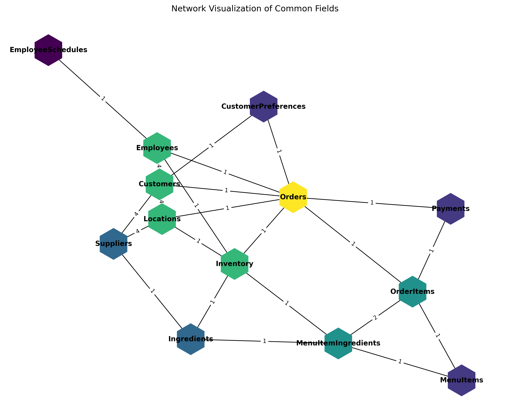

# Moria AI Lab - Data Readiness Engine

Trust is the data practitioner's most important asset. Moria’s Data Readiness Engine provides an intuitive way to understand the gap between source data and the business most actionable insights. Data readiness goes beyond just data quality. It’s about understanding your problem and leverage your data to solve it and demonstrate real impact

<a href="https://github.com/moria-ai-labs/data_readiness" class="my-button">Visit Open-Source Project</a>

## What is Data Readiness?

Data Readiness is an outcome-centered evaluation of the journey from insights to data sources. 

## What's the difference between data quality and Data Readiness?

In most cases, data quality is table/asset centered. Current data quality solutions provide assessments of the asset data quality without considering how data sources connect with each other. More importantly, data quality alone does not answer the question: "how might we understand [insert business performance outcome]?" 

  

    <h3>Card 1</h3>
    
This is the first card.

    <a href="https://github.com/" class="my-button">Learn More</a>
  

  

    <h3>Card 2</h3>
    
This is the second card.

    <a href="https://github.com/" class="my-button">Learn More</a>
  

## Find more (WIP)

<iframe src="/assets/assets_network_Version2.html" width="100%" height="600" frameborder="0"></iframe>

- 🚀 Check out our [Data Readiness Engine](./projects)!
- 📄 Read the [documentation](./docs)!
- ✉️ [Contact me](mailto:your@email.com)