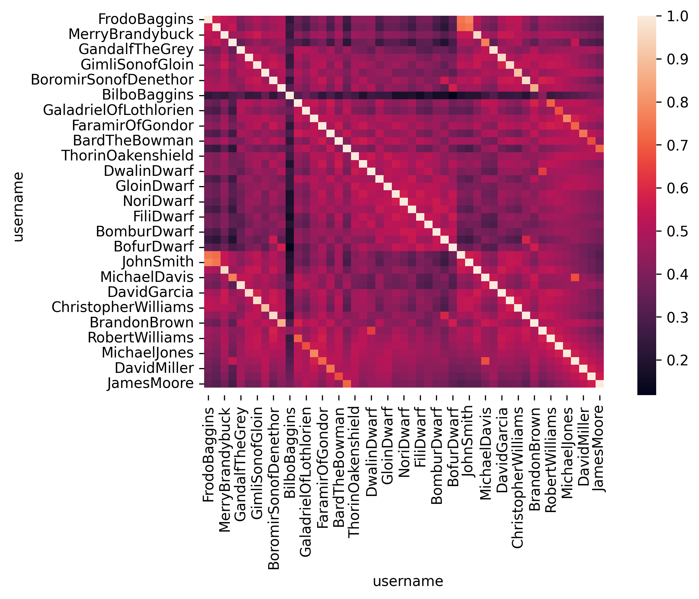

# Unlocking Customer Insights: A Graph-Powered Approach to A/B Testing at Lonely Mountain Online Bank
## What is A/B Testing?
A/B testing, at its core, is a method of comparing two versions of a webpage, app feature, or marketing campaign to determine which performs better. It’s essentially a controlled experiment where users are randomly divided into two groups: one sees version A (the control), and the other sees version B (the variation). By tracking key metrics like click-through rates, conversion rates, or engagement, businesses can make data-driven decisions about which version to implement more widely.

At Lonely Mountain Online Bank, A/B testing is crucial for optimizing our user experience, from the layout of our online banking portal to the messaging in our promotional emails. For example, we might A/B test two different designs for our account creation page to see which one leads to more successful sign-ups.

## The Power of A/B Testing in Online Banking
In the fast-paced world of online banking, even small changes can have a significant impact on customer satisfaction and business outcomes. A/B testing allows us to:

- Improve User Experience: By testing different interfaces and workflows, we can identify what resonates best with our customers, making their banking experience smoother and more intuitive.
- Increase Conversions: Whether it’s opening a new account, applying for a loan, or using a new feature, A/B testing helps us optimize the paths our customers take to achieve their financial goals.
- Reduce Risk: Instead of rolling out changes blindly, A/B testing provides data to support decisions, minimizing the risk of negatively impacting customer engagement or revenue.
- Personalize Experiences: Understanding how different segments of our customer base respond to variations helps us tailor future offerings and communications more effectively.

## Beyond Simple Comparisons: The Benefits of a Graph/Network Approach
While traditional A/B testing focuses on comparing two isolated versions, a graph or network approach takes this a step further by understanding the relationships and interactions between different elements being tested and their impact on user journeys. Imagine our online banking platform as a complex network of pages, features, and user actions.

With a graph approach, we can:

- Identify Indirect Impacts: A change on one page might seem minor, but a graph approach can reveal its ripple effect across the entire user journey. For instance, an A/B test on a login screen might not just affect login rates, but also subsequent navigation to investment tools. A network view helps us see these interconnected effects.
- Understand User Flows Holistically: Instead of just looking at conversion rates on a single page, a graph approach allows us to visualize entire user paths. This helps us understand if a successful A/B test on one step of a process truly leads to a complete, desired outcome, or if it creates bottlenecks elsewhere in the journey.
- Optimize Multi-Step Processes: Many banking processes involve multiple steps (e.g., loan application, credit card sign-up). A graph-based A/B test can analyze how variations at each stage influence the overall completion rate, identifying the optimal sequence and design across the entire journey.
- Detect Unintended Consequences: Sometimes, optimizing one part of the user experience can inadvertently negatively impact another. A network perspective helps to uncover these unintended consequences by showing how changes propagate through the system.
- Enhance Personalization: By mapping out user behaviors as a graph, we can run A/B tests that are more nuanced, targeting specific user segments based on their historical interactions and preferences within the banking network.

At Lonely Mountain Online Bank, embracing a graph/network approach to A/B testing allows us to move beyond isolated experiments and gain a deeper, more interconnected understanding of our customers' online banking journeys. This enables us to make more informed, strategic decisions, ultimately leading to a more seamless and satisfying experience for all our customers.

## Use Case: The Lonely Montain Online Bank

Below is a common use case - a fictional Online Bank with a solid customer base. How might we create a digital footprint of the client and provide a platform to simulate all business aspects? In this case an AB test?

<iframe src="/assets/the_lone_mountain_network.html" width="100%" height="600" frameborder="0"></iframe>

