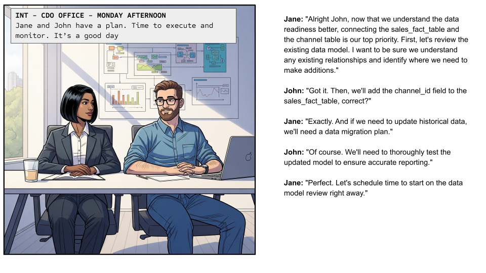

# User Stories

Below are four user stories illustrated with images. Each panel represents a step in the journey.

  

    
    
<strong>Step 1:</strong> [Brief description of what happens in this panel]

  

  

    
    
<strong>Step 2:</strong> [Brief description of what happens in this panel]

  

  

    
    
<strong>Step 3:</strong> [Brief description of what happens in this panel]

  

  

    
    
<strong>Step 4:</strong> [Brief description of what happens in this panel]

  

---

*Replace the descriptions in brackets with your actual story steps for each panel. Make sure your images are named `story1.png`, `story2.png`, `story3.png`, `story4.png` and are located in the `assets` folder at the root of your repository.*